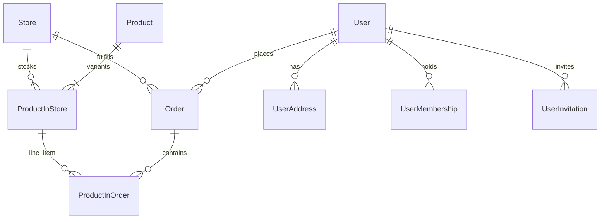

# Store API Server Documentation

## 1. Project Overview & Architecture
The project follows a **fully modular architecture**, designed to support a scalable Super App ecosystem.

### Key Resources
> [!IMPORTANT]
> PLEASE REFER TO THESE DETAILED DOCUMENTS FOR EXHAUSTIVE INFO:
> 1.  **[Database Schema (ERD)](ERD_Detailed.md)**: Every model, field, and relationship.
> 2.  **[API Architecture & Endpoints](API_Architecture_Detailed.md)**: Endpoint list, Request/Response standards.
> 3.  **[Business Logic & Algorithms](Business_Logic_Detailed.md)**: Deep dive into complexities (Auth, Recommendations, Orders).

---

## 2. Domain Structure
1.  **`user`**: Identity, Profile, Invitation System.
2.  **`store`**: Physical Outlets.
3.  **`product`**: Catalog, Inventory (`ProductInStore`), Pricing.
4.  **`order`**: Transaction Processing, Validation.
5.  **`wallet`**: Digital Money (Topup, Transfer).
6.  **`payment`**: Gateway Integration.
7.  **`voucher`**: Coupon System.
8.  **`membership`**: Loyalty Tiers & Points.
9.  **`address`**: Location Services.
10. **`point`**: External Redemptions.

---

## 3. High-Level ERD
*Refer to [ERD_Detailed.md](ERD_Detailed.md) for the full field list.*

---

## 4. Key Logic Highlights
*   **Invitation Reward**: Inviter gets points on Invitee's **first login**.
*   **Recommendations**: Products are ranked by **tag overlap** with user's last purchase.
*   **Ordering**: Strict **ACID transactions** ensure stock, quota, and voucher consistency.
*   **Addresses**: Automatic `is_main_address` switching ensures a single primary address.

---

## 5. Development & Testing
*   **Run Server**: `python manage.py runserver`
*   **Run Tests**: `python manage.py test`
*   **Naming**: JSON (`snake_case`), Classes (`PascalCase`), Variables (`snake_case`).
